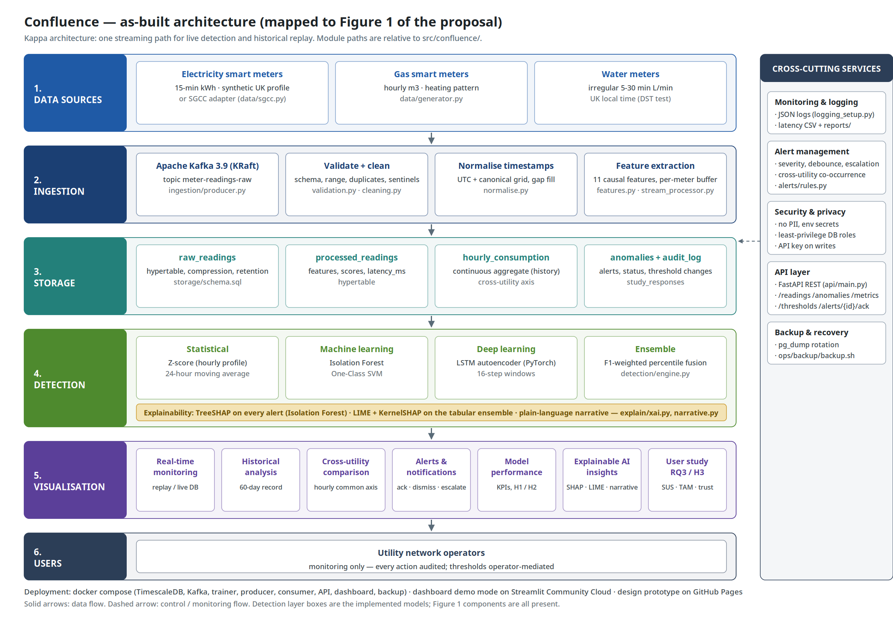

# Architecture

## Kappa, not Lambda

The platform has a **single streaming path**. Live readings and historical replays pass through the same code (`ingestion/stream_processor.py`): validation, cleaning, timestamp normalisation, feature extraction, detection and explanation. Historical reprocessing means replaying the Kafka topic (or the source files, through `producer.py`) into a new consumer group. There is no separate batch layer.

- **Lambda rejected:** a batch layer and a speed layer would duplicate the feature and model code. That means two implementations to keep consistent, for no accuracy benefit here, since every detector scores one reading at a time.
- **Serverless rejected:** function cold starts are non-deterministic (often seconds) and would put the 2.5 s alert-latency target (H2) at risk. The detectors also need per-meter state (the last 24 h of readings), which suits a long-running consumer.

Offline training and evaluation (`evaluation/run.py`) reuse the same validation, cleaning, normalisation and feature modules. The streaming processor is additionally checked against the batch path in `tests/test_detection.py`.

## Layers (Figure 1) and where they live

| Layer | Component | Code |
|---|---|---|
| 1 Data sources | Synthetic electricity / gas / water generator; SGCC and London smart-meter adapters | `data/` |
| 2 Ingestion | Kafka producer (UTC-ordered replay, `produced_at` stamp), consumer micro-batches | `ingestion/producer.py`, `consumer.py` |
| | Validation → cleaning → UTC + canonical grid → 11 causal features | `validation.py`, `cleaning.py`, `normalise.py`, `features.py`, `stream_processor.py` |
| 3 Storage | Hypertables `raw_readings`, `processed_readings`, `anomalies`; continuous aggregate `hourly_consumption`; `audit_log`, `threshold_changes`, `study_responses`; compression and retention | `storage/schema.sql`, `storage/db.py` |
| 4 Detection | Z-score, moving average, Isolation Forest, One-Class SVM, LSTM autoencoder, weighted ensemble | `detection/` |
| | TreeSHAP per alert, LIME / KernelSHAP on demand, narrative | `explain/` |
| 5 Visualisation | Streamlit: monitoring, historical, cross-utility, alerts, KPIs, XAI, user study | `dashboard/` |
| 6 Users | Operators: monitoring only, with human decisions audited | — |
| Cross-cutting | JSON logging · alert rules and escalation · security (env secrets, roles, API key) · FastAPI REST · pg_dump backup | `logging_setup.py`, `alerts/rules.py`, `api/main.py`, `ops/backup/` |

## Heterogeneous frequencies

| Utility | Raw | Canonical grid | How |
|---|---|---|---|
| Electricity | 15-min, UTC | 15-min | direct |
| Gas | hourly, UTC | 1 h | direct |
| Water | irregular 5–30 min, **UK local time** | 15-min | convert to UTC (DST-aware), bin mean, interpolate gaps of at most 2 steps and flag them |

Cross-utility views use the hourly continuous aggregate (`hourly_consumption`) as a common axis.

## Ensemble

Each detector's raw score is mapped to its percentile against validation scores. The ensemble score is the average of these percentiles, weighted by validation F1 ("weighted voting"). A single threshold, calibrated on validation, makes the decision ("decision fusion"). `votes` (the number of detectors over their own thresholds) drives the severity rules.
